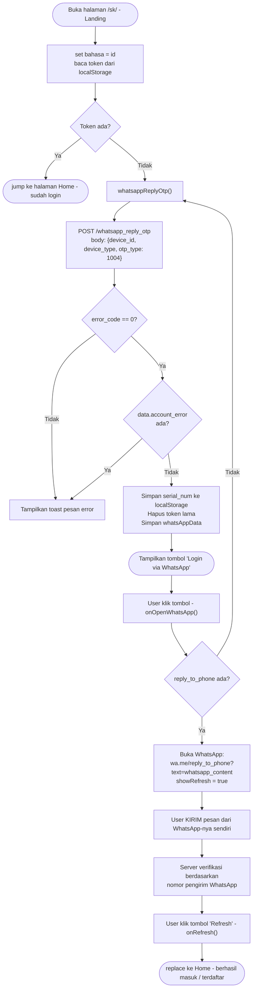
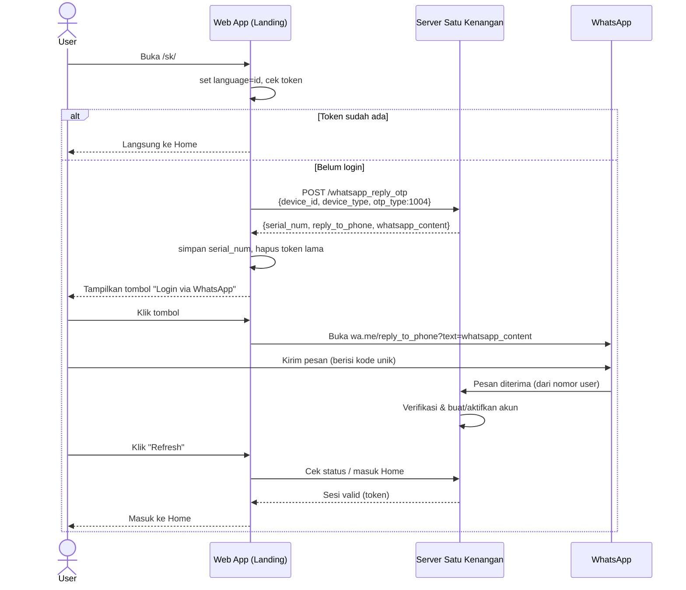

# Alur Register / Login — Satu Kenangan (Kopi Kenangan)

Dokumen ini menjelaskan alur autentikasi aplikasi **Satu Kenangan** (`order.kopikenangan.com/sk/`)
berdasarkan analisis file bundle:

- `api-iqBu4Ynb.js` — kumpulan fungsi API client
- `view.Landing-DRUkapcY.js` — halaman Landing yang menjalankan alur login/register
- `satu_kenangan-BiKgLHwO.js` — bundle inti (Vue + Vue Router + objek `share` untuk key localStorage)

> **Kesimpulan utama:** Tidak ada endpoint `register` terpisah.
> Register & login **digabung** dalam satu alur **"Login via WhatsApp" berbasis _reverse OTP_**.
> Identitas Anda diverifikasi dari **nomor pengirim WhatsApp**, bukan dari kode yang Anda ketik.
> Jika nomor belum terdaftar, mengirim pesan pertama akan otomatis membuatkan akun (itulah "register"-nya).

---

## 1. Diagram Alur (Flowchart)



---

## 2. Diagram Urutan (Sequence Diagram)



---

## 3. Endpoint & Body yang Terlibat

| Langkah | Fungsi API | Endpoint | Body |
|--------|-----------|----------|------|
| Mulai OTP (login/register) | `whatsapp_reply_otp(body)` | `POST /web_order/api/satu_kenangan/whatsapp_reply_otp` | `{ device_id, device_type, otp_type: 1004 }` |
| Cek status OTP (opsional) | `whatsapp_otp_status(serial_num)` | `POST /web_order/api/satu_kenangan/query_whatsapp_reply_otp_status` | `{ serial_num }` |
| Alternatif berbasis nomor* | `get_access_token(phone)` | `POST /web_order/api/satu_kenangan/get_access_token` | `{ phone }` |

\* `get_access_token` **tidak dipakai** pada alur Landing utama; alur utamanya murni reverse-OTP lewat `whatsapp_reply_otp`.

### Respons `whatsapp_reply_otp` (saat sukses, `error_code === 0`)

```json
{
  "error_code": 0,
  "data": {
    "serial_num": "...",
    "reply_to_phone": "62xxxxxxxxxx",
    "whatsapp_content": "teks berisi kode unik yang harus dikirim",
    "account_error": null
  }
}
```

---

## 4. Header standar setiap request

Fungsi `post()` menambahkan header berikut ke semua request:

```
Accept: application/json
language: id            (dari localStorage, default "id")
time_zone: <offset jam> (mis. 7 untuk WIB)
authorization: <token>  (jika sudah login)
```

---

## 5. Cara menggunakannya (dengan nomor Anda sendiri)

1. Buka `https://order.kopikenangan.com/sk/` di **HP** yang ada WhatsApp-nya.
2. Klik **"Login via WhatsApp"**.
3. WhatsApp terbuka dengan pesan sudah terisi — **kirim apa adanya** ke nomor resmi.
4. Kembali ke browser, klik **"Refresh"**.
5. Anda masuk ke Home. Jika nomor belum pernah terdaftar, akun otomatis dibuat pada langkah ini.

> Karena verifikasi memakai **nomor pengirim WhatsApp**, gunakan HP & nomor Anda sendiri.

---

## Catatan Teknis

- **Reverse OTP:** berbeda dari OTP biasa. Anda **mengirim** pesan berisi kode (bukan menerima lalu mengetik). Server memverifikasi dari nomor pengirim.
- **`otp_type: 1004`** = kode jenis OTP untuk alur login WhatsApp ini.
- **`device_id`** dibuat sekali lalu disimpan di `localStorage["sk:deviceId"]`, digunakan ulang di kunjungan berikutnya.
- **`share`** adalah objek berisi nama-nama key localStorage (`share.token`, `share.language`, `share.serial_num`) yang didefinisikan di bundle inti.
```
